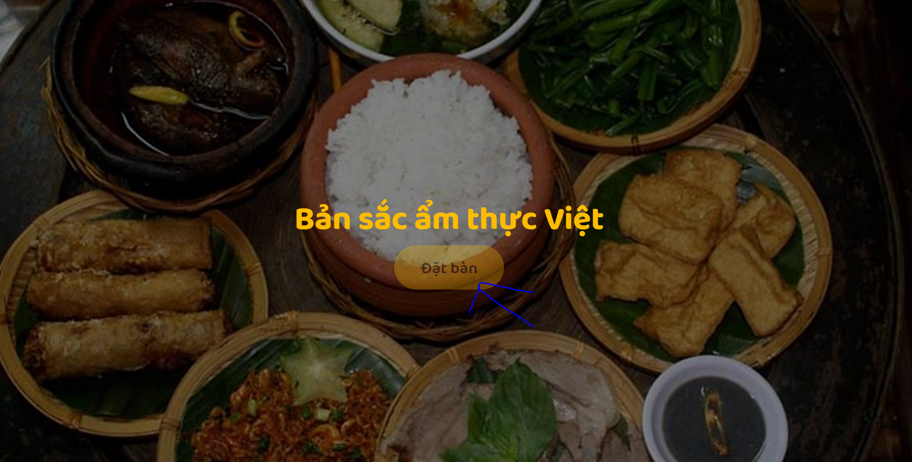
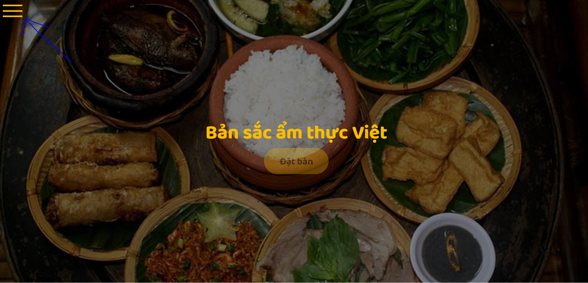
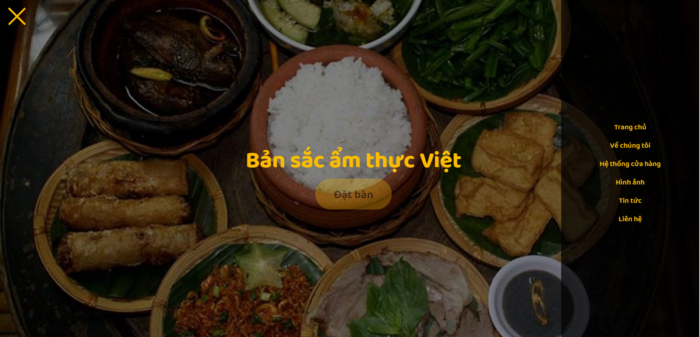
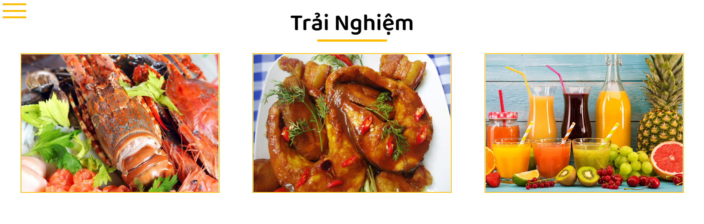
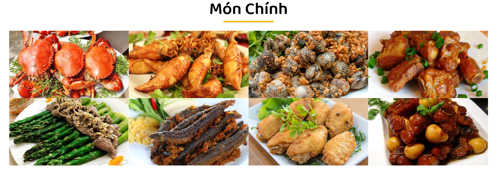
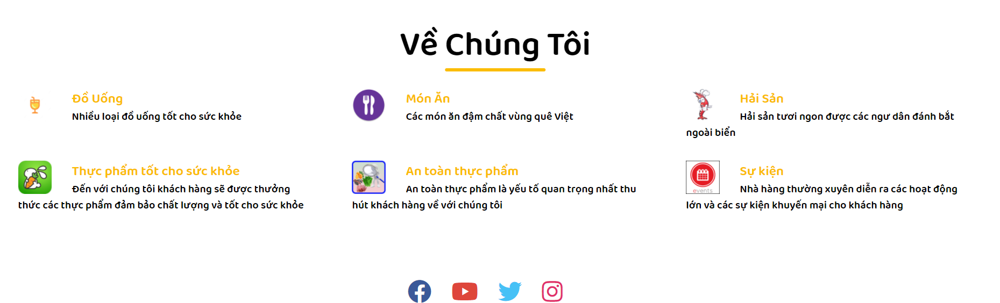

# Bài báo cáo thiết kế website
## Website ẩm thực 
#### Sinh viên: Vũ Văn Quân
#### MSV: 1821050765
#### Lớp: DCCTDH63B
#### Học Phần: 7080211
#### Nhóm: 11
# Đây là trang chủ website 
## phần header khi kéo chuột vào "Đặt Bàn " sẽ có hiệu ứng
## Khi click vào biểu tượng menu sẽ hiện ra các menu item như ở hình 3

#  Phần content có 3 section
## Section đầu tiên là phần các món ăn nổi bật của nhà hàng

## Section 2 là phần liệt kê ra các món ăn của nhà hàng

## Section 3 là giới thiệu tất cả các mục của nhà hàng và đường  link tới các mạng xã hội của nhà hàng

